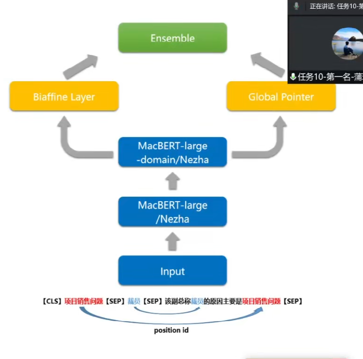
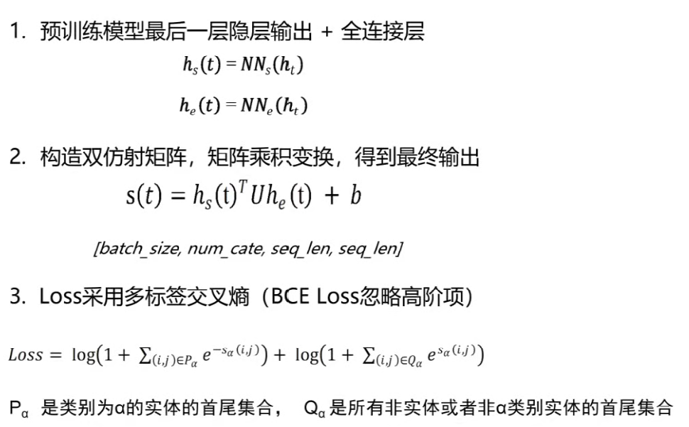
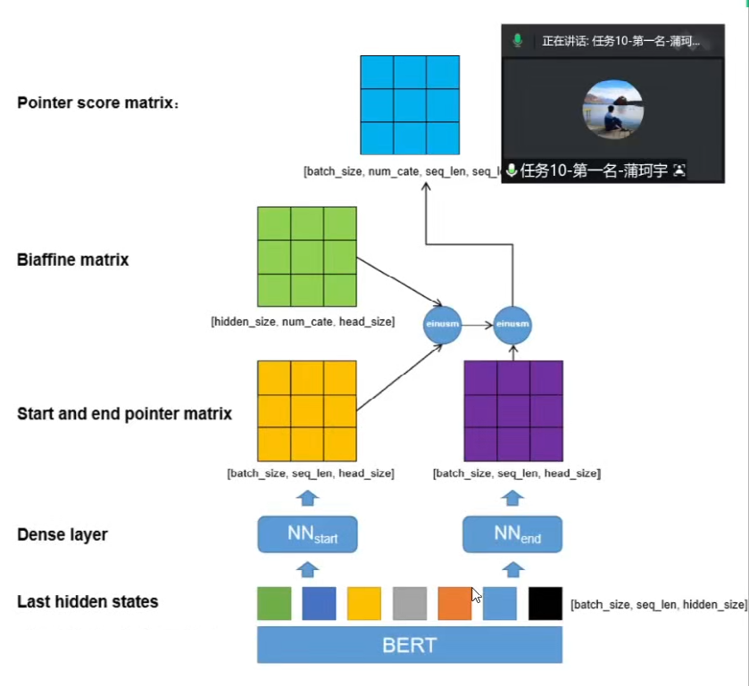
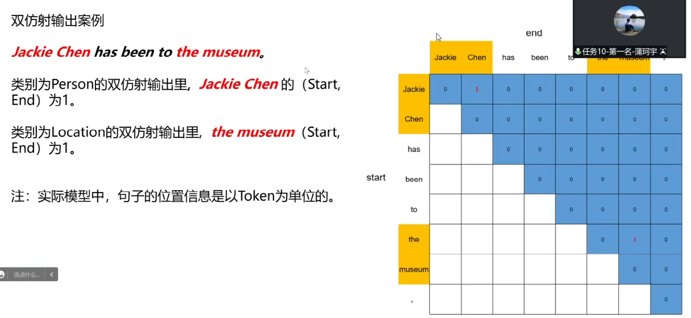
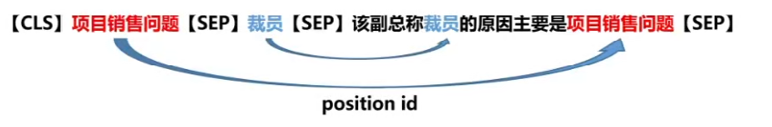

[返回目录](../../readme.md)
# 任务十：面向金融领域的因果事件要素抽取

[评测地址](https://www.biendata.xyz/competition/ccks-nec-2022/)

## 1. 任务描述

本任务旨在从海量财经新闻中抽取因果事件并补齐相关事件要素，并将相同的事件聚合到一起。因果事件要素的抽取，该任务目标是继因果关系抽取后，从因果事件所在篇章抽取原因事件要素和结果事件要素

即给定文本T，及其包含的原因事件C和结果事件E，分别抽取C和E中的事件要素，如下：
<table>
	<tr>
	    <th></th>
	    <th>事件要素</th>
	    <th>事件要素描述</th>  
	</tr >
	<tr >
	    <td rowspan="3">Core-argument</td>
	    <td>actor</td>
	    <td>施事，指事件动作主体，一个或多个实体构成</td>
	</tr>
	<tr>
	    <td>action</td>
	    <td>动作，描述事件行为或状态，多为动词</td>
	</tr>
	<tr>
	    <td>object</td>
	    <td>受事，指事件动作客体，一个或多个实体构成</td>
	</tr>
	<tr>
	    <td rowspan="4">Financial-
Adjuncts</td>
	    <td>region</td>
      <td>区域，指事件涉及地点、区域等</td>
	</tr>
	<tr><td>industry</td>
	    <td>行业，指事件涉及的行业/产业/市场，指生产同类产品或多类产品集合划分的经济活动类别</td>
	</tr>
	<tr>
	    <td>organization</td>
	    <td>机构，指事件涉及机构/公司/企业名称</td>
	</tr>
	<tr>
	    <td>product</td>
	    <td>产品，指事件涉及产品，通常指经营活动中的具体产品</td>
	</tr>	
</table>

## 2. 数据描述

**输入**：一段文本，其包含的原因事件C和结果事件E

**输出**：原因事件和结果事件的事件要素

**示例**：

样例一：

  输入：

  `{“text_id”:”123456”, ”text”: “恒大地产2012年拟裁员30%：1月4日，恒大地产（3333.HK）的一位副总裁向记者确认，公司内部发文，2012年将裁员30%。知情人士透露，按步骤初期只裁10%，因为2009年裁员的时候，矛盾冲突比较激烈。该副总称裁员的原因主要是项目销售问题。”, “cause_effect_list”: [{“id”:”123456_0”, “cause_mention”:”项目销售问题”,”effect_mention”:”裁员”}]}`
  输出：

  `{“text_id”:”123456”,” cause_effect_list”:[{“id”:”123456_0”, “cause_mention”:”项目销售问题”, ”cause_actor”:”项目”, “cause_action”:”销售问题”, “cause_object”:””, “cause_region”:[],”cause_industry”:[”地产”], “cause_organization”:[“恒大地产”], “cause_product”:[], “effect_mention”:[“裁员”], ”effect_actor”:[“恒大地产”], “effect_action”:[“裁员”], “effect_object”:””, “effect_region”:[], ”effect_industry”:[“地产”], “effect_organization”:[“恒大地产”], “effect_product”:[]}]}`

**训练集&验证集：**
在训练及验证数据发布阶段，会发布5k条左右的事件对和1k条验证集。训练集每行为一个json格式，“text_id”为样本编号，“text”为文本，“cause_mention”为原因事件文本，“cause_actor”为原因事件施事要素，“cause_action”为原因事件动作，“cause_object”为原因事件受事，“cause_region”为原因事件涉及区域，“cause_industry”为原因事件涉及行业，“cause_organization”为原因事件涉及机构，“cause_product”为原因事件提及产品，effect结果事件诸如上包含effect_mention, effect_actor, effect_action, effect_object, effect_region, effect_industry, effect_organization, effect_product。其中，事件要素取值可能重复与嵌套，如cause_organization和effect_organization取值一致等。
**测试集：**
在测试数据发布阶段，会再发布1千条左右的文本数据集，不含标注结果。以json格式，包含“text_id”,“text”, “cause_mention”, “effect_mention”。

[训练数据](../dataset/task%2010/训练数据.json)

[验证集](../dataset/task%2010/验证集.json)

[测试集](../dataset/task%2010/测试集.json)

## 3. TOP1方案

### 3.1 数据分析
训练集: 4000条

测试集: 500条

要素: 14个(6个核心要素, 8个附加要素)

文本长度均值: 195

文本长度<=512占比: 97.3%

主、谓、地点要素标签占比较大

### 3.2 整体方案

**把金融事件抽取转换为命名实体识别任务**

* 原因事件+结果事件+原始文本->相关实体
* 预训练模型: MacBERT 和NEZHA
* 指针网络:双仿射和全局指针
* 其他策略
  * 数据清洗，数据增强
  * 继续预训|练(task- adaptive pretraining)
  * 对抗训练
  * 自定义position id
  * 投票

**双仿射模型细节**

### 3.3 数据清洗
数据清洗方案:

1. 将数据拆分成10fold,用每一折的训练数据训练模型，井预测剩下的一份数据
2. 将第一步预测的10份数据组成一份完成的训练集数据
3. 根据需要，重复第一二步，得到多份由模型预测而来的训练集数据，如5份。
4. 基于原始训练集进行数据清洗:
  * 增加实体:原始训练集没有，但是在5份训练集里都有的实体
  * 删除实体:原始训练集有，但是在5份训练集里都没有的实体

### 3.4 其他Tricks和创新点
* 继续预训练:基于任务的数据集让预训练模型继续预训练(task adaptive pretraining)。根据论文《Don' t Stop Pretraining: Adapt Language Models to Domains and Tasks》, 预训练模型在任务领域和任务数据上进行继续预训练，会有比较明显的增益效果。我们在该任务中进行了尝试，基于task的继续预训练无明显增益效果，使用外部金融事件领域的数据集(domain-adaptive
pretraining)应该会有提升(未进行尝试)
* 加入FGM对抗训练，少量提升
* 数据增强：无明显提升
* 自定义position id,令原因事件C、结果事件E的position id和原始文本相关联，得到了部分提升

  
* 投票：明显提升

### 3.5 结果与分析
基于A榜的分析: 

在这个任务中，NEZHA相比MacBERT效果 好一些，加入postion id和数据清洗都为最终的效果带来了一定的提升，尤其是数据清洗，持续的清洗迭代为最终结果都带来的一定的提升，加入其他的Tricks未有显著变化。

最终的单模水平大概在59.5左右。

加入投票策略后来到61以上。
