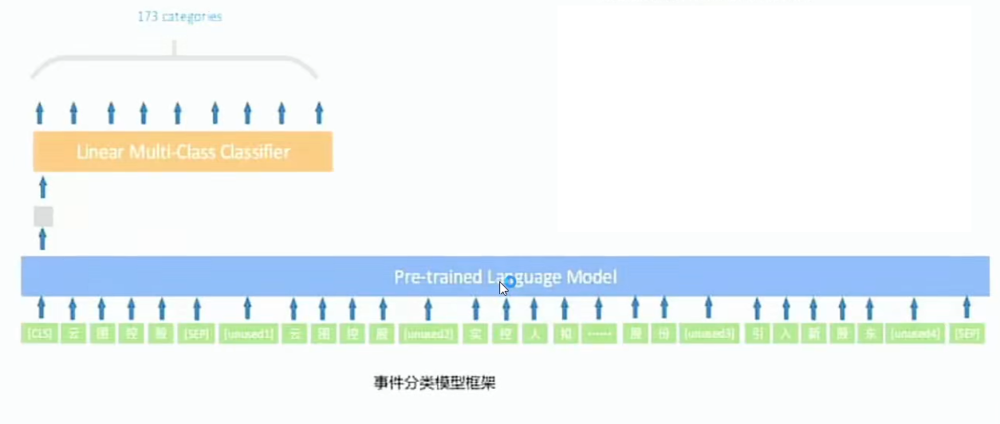

[返回目录](../../readme.md)
# 任务八：面向金融领域的Few-Shot事件抽取

[评测地址](https://www.biendata.xyz/competition/ccks2022_eventext/)

## 1. 任务描述
本次评测任务的文本语料来自于互联上的公开新闻、报告。给定M个事件类型及其要素的schema，训练数据中给出其中N（N < M）个事件类型的标注数据，对测试集中M个事件类型及其要素进行抽取。该任务旨在通过部分标注事件对未标注或者欠标注的事件进行预测。
## 2. 数据描述
本次数据主要来自金融领域的公开新闻、报道，样本包含正样本和负样本，训练集、验证集及测试集的说明如下：

任务一：

训练集&验证集：

在训练及验证数据发布阶段，会有5万条左右的文本及其所标注的事件类型以及每个文本标注的事件要素作为训练集。1万条左右的文本及其所标注的事件类型以及每个文本标注的事件要素作为验证集（验证集中出现在N中事件类型比例未知）

测试集：

在测试数据发布阶段，会有1万条左右的文本数据集以及一定数量的干扰数据，不含标注结果，作为测试。（测试集中出现在N中事件类型比例未知）

[训练数据](../dataset/task%208/train_data_final.txt)

[A榜测试数据](../dataset/task%208/testA_text_final.txt)

[B榜测试数据](../dataset/task%208/all_testB.txt)

## 3. TOP1方案

### 3.1 任务介绍
#### 任务：面向金融领域的Few-Shot事件抽取
事件抽取:给定金融领域可能包含金融事件的文本，从中抽取事件类型和对应的事件主体公司

Few-Shot: 16个FEW-SHOT事件在训练集中标注样本10个左右，但在测试集中数量很多

#### 任务难点
* 事件类别分布极不均衡，训练集与测试集数据分布不同
* Few-Shot事件与高频事件标签混淆
* 数据存在噪声，文本格式不规范
### 3.2 方案架构

#### 3.2.1 数据预处理

##### 文本空格判断
1. 针对空格进行MASK
2. 使用预训练模型进行空格预测
  * 预测如果是任意标点，则用标点替揍空格
  * 预测如果非标点，则去掉原文中的空格

##### 数据增强
* 样本复制
  * 若是Few-Shot样本，复制50遍
  * 若非Few-Shot样本，复制200/事件频次
* 复制方法
  * 基于训练集的公司集合,70%的可能随机替换公司名称
  * 基于训练集的文本集合，样本首尾各20%可能拼接文本

#### 3.2.2 实体识别

##### 阅读理解模型

* Query模板
  1. 文本中涉及金融事件的公司有哪些?
  2. 文本中的公司名称有哪些?
* 训练及优化策略
  1. SWA随机权重平均
  2. 对抗训练(FGM)
  3. 模型融合:采用不同Query模板，划分不同的训练集和测式集，训练三个实体识别模型，将三者预测结果合并
  4. 后处理:过滤错误公司实体，如含有标点符号，特殊字符。长度过长等

##### 事件分类

* 训练策略
  * 单标签多分类，训练数据中，单个公司存在多个事件占比小，如果使用多标签多分类会因为数据的稀疏性影响效果
  * 将实体识别出的公司名称与文本进行拼接，并且在文本中通过unused1和unused2进行包裹公司名称
  * 针对few-shot标签关键词特征进行人工整理，用unused3和unused4进行包裹，使模型更关注few-shot这些特征
  * 在全量训练完的基础模型的基础下，对few-shot事件单独进行finetune，提升明显
  * 对抗训练(FGM)
  * SWA随机权重平均
* 模型融合策略
  * 采用不同的预训练模型，不同的Few- Shot事件finetune步数，训练6个模型对预测结果进行投票，若票数一致优先选择Few-Shot标签

### 3.3 结果与总结

#### 总结
* 依据任务数据特点，进行有效的数据增强是提升模型性能的基础。
* 任务的定义及转化至关重要。
* 小样本事件的特征提取及finetune效果提升明显.
* 利用不同的预训练模型及训练策略，增加模型多样性，可提升模型融合效果。
