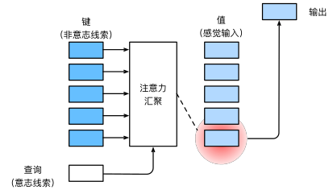

[返回目录](../../readme.md)

意志线索被称为Query,每个值都与一个键（key）配对,通过注意力池化层来有偏向性的选择某些输入
### 非参数注意力汇聚
**Nadaraya-Watson核回归**

$f(x) = \sum_{i=1}^n \frac{K(x - x_i)}{\sum_{j=1}^n K(x - x_j)} y_i$

**通用的注意力汇聚公式**
$f(x) = \sum_{i=1}^n \alpha(x, x_i) y_i$

**高斯核**

$K(u) = \frac{1}{\sqrt{2\pi}} \exp(-\frac{u^2}{2})$

**那么**
$f(x) =\sum_{i=1}^n \alpha(x, x_i) y_i $

$= \sum_{i=1}^n \frac{\exp\left(-\frac{1}{2}(x - x_i)^2\right)}{\sum_{j=1}^n \exp\left(-\frac{1}{2}(x - x_j)^2\right)} y_i $

$= \sum_{i=1}^n \mathrm{softmax}\left(-\frac{1}{2}(x - x_i)^2\right) y_i$

如果一个键$x_i$越是接近给定的查询$x$， 那么分配给这个键对应值$y_i$的注意力权重就会越大， 也就“获得了更多的注意力”。

