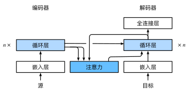

[返回目录](../../readme.md)

编码器对每个词的输出作为key和value(key=value)，解码器RNN对上一个词的输出作为query，注意力的输出和下一个词的词嵌入合并作为解码器该时刻的输入。

注意力的输出替代了之前seq2seq的上下文context中最后一个时刻最后一层的state。

注意力机制可以根据解码器RNN的输出来匹配到合适的编码器RNN的输出来更有效的传递信息，即模型在预测下一个词时将注意力集中在原句的部分词上(一般和词出现的顺序有关)