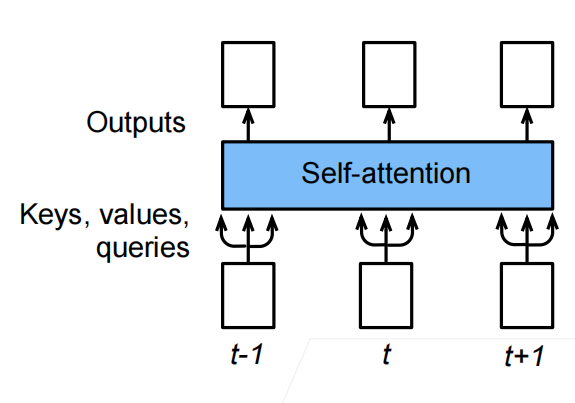
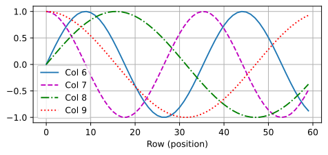
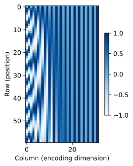
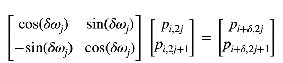

[返回目录](../../readme.md)
### 自注意力机制


给定序列$\mathbf{x}_1, \ldots, \mathbf{x}_n$其中任意$\mathbf{x}_i \in \mathbb{R}^d (1 \leq i \leq n)$

自注意力池化层将$\mathbf{x}_i$当做key，value，query来对序列抽取特征得到$\mathbf{y}_1, \ldots, \mathbf{y}_n$，其中$\mathbf{y}_i = f(\mathbf{x}_i, (\mathbf{x}_1, \mathbf{x}_1), \ldots, (\mathbf{x}_n, \mathbf{x}_n)) \in \mathbb{R}^d$

### 位置编码

跟CNN/RNN不同，自注意力并没有记录位置信息

位置编码是将位置信息注入到输入里：假设输入表示$\mathbf{X} \in \mathbb{R}^{n \times d}$包含一个序列中n个词元的d维嵌入表示。 位置编码使用相同形状的位置嵌入矩阵$\mathbf{P} \in \mathbb{R}^{n \times d}$输出X+P，矩阵第i行、第2j列和2j+1列上的元素为：
$p_{i, 2j} = \sin\left(\frac{i}{10000^{2j/d}}\right),\\p_{i, 2j+1} = \cos\left(\frac{i}{10000^{2j/d}}\right).$



也就是说对于每一个样本每一个特征维度加上一点点不一样的值，使模型分辨这些细微的变化作为位置信息

#### 位置编码实现

```python
#@save
class PositionalEncoding(nn.Module):
    """位置编码"""
    def __init__(self, num_hiddens, dropout, max_len=1000):
        super(PositionalEncoding, self).__init__()
        self.dropout = nn.Dropout(dropout)
        # 创建一个足够长的P
        self.P = torch.zeros((1, max_len, num_hiddens))
        X = torch.arange(max_len, dtype=torch.float32).reshape(
            -1, 1) / torch.pow(10000, torch.arange(
            0, num_hiddens, 2, dtype=torch.float32) / num_hiddens)
        self.P[:, :, 0::2] = torch.sin(X)
        self.P[:, :, 1::2] = torch.cos(X)

    def forward(self, X):
        X = X + self.P[:, :X.shape[1], :].to(X.device)
        return self.dropout(X)
```

#### 绝对位置编码

可以将位置编码矩阵看做是对每一样本(词)的位置信息进行编码，将第i个样本用长为d的向量进行编码，靠前的特征维度频率变化快


#### 相对位置编码

用sin、cos函数可以使编码包含相对的位置信息，即位于$i + \delta$处的位置编码可以线性投影到位置$i$处的位置编码

记$\omega_j = 1/10000^{2j/d}$，那么


投影矩阵与i无关

意味着能够更好的关注词与词之间的相对位置信息，而无需过度关心绝对位置

