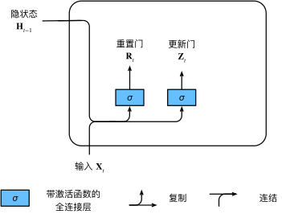
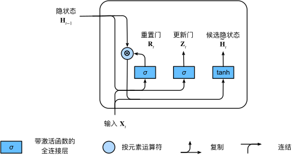

[返回目录](../../readme.md)
### 重置门和更新门

$\mathbf{R}_t = \sigma(\mathbf{X}_t \mathbf{W}_{xr} + \mathbf{H}_{t-1} \mathbf{W}_{hr} + \mathbf{b}_r)$

$\mathbf{Z}_t = \sigma(\mathbf{X}_t \mathbf{W}_{xz} + \mathbf{H}_{t-1} \mathbf{W}_{hz} + \mathbf{b}_z)$

### 候选隐状态

$\tilde{\mathbf{H}}_t = \tanh(\mathbf{X}_t \mathbf{W}_{xh} + \left(\mathbf{R}_t \odot \mathbf{H}_{t-1}\right) \mathbf{W}_{hh} + \mathbf{b}_h)$

其中$\mathbf{R}_t$是取值为0-1的矩阵，列数等于num_hidden，全0表示全部遗忘，全1表示全部保留。
$\odot$为按元素点乘

### 隐状态

$\mathbf{H}_t = \mathbf{Z}_t \odot \mathbf{H}_{t-1}  + (1 - \mathbf{Z}_t) \odot \tilde{\mathbf{H}}_t$

$\mathbf{Z}_t$与$\mathbf{R}_t$类似，全1表示不更新，忽略掉$\mathbf{X}_t$，全0就相当于普通的RNN