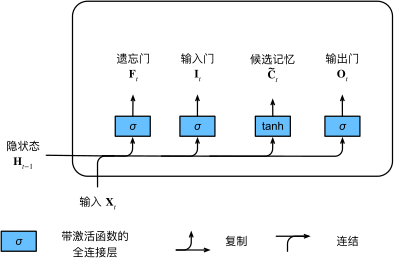

[返回目录](../../readme.md)
### 输入门、忘记门和输出门

$\mathbf{I}_t = \sigma(\mathbf{X}_t \mathbf{W}_{xi} + \mathbf{H}_{t-1} \mathbf{W}_{hi} + \mathbf{b}_i),$
$\mathbf{F}_t = \sigma(\mathbf{X}_t \mathbf{W}_{xf} + \mathbf{H}_{t-1} \mathbf{W}_{hf} + \mathbf{b}_f),$
$\mathbf{O}_t = \sigma(\mathbf{X}_t \mathbf{W}_{xo} + \mathbf{H}_{t-1} \mathbf{W}_{ho} + \mathbf{b}_o)$

### 候选记忆单元

$\tilde{\mathbf{C}}_t = \text{tanh}(\mathbf{X}_t \mathbf{W}_{xc} + \mathbf{H}_{t-1} \mathbf{W}_{hc} + \mathbf{b}_c)$

### 记忆单元

$\mathbf{C}_t = \mathbf{F}_t \odot \mathbf{C}_{t-1} + \mathbf{I}_t \odot \tilde{\mathbf{C}}_t$

感性认知：前半段为过去状态，后半段为当前状态。

Q:这一块和GRU的隐状态计算相似，他们有什么不同？
A:在GRU隐状态计算中，前一时刻隐层比重增加，则当前输入数据的比重就减少；而LSTM中前一时刻记忆单元的数据和候选记忆单元的比重由两个不同的门（遗忘门和输入门）控制，不会相互影响

### 隐状态

$\mathbf{H}_t = \mathbf{O}_t \odot \tanh(\mathbf{C}_t)$

$\tanh(\mathbf{C}_t)$的作用是保证$\mathbf{H}_t$最后的值在[-1,1]

极端情况下$\mathbf{O}_t$变成0，表示当前$\mathbf{H}_t$和过去信息都不要，相当于重置