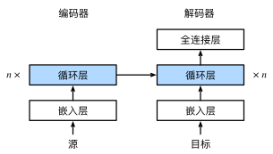

[返回目录](../../readme.md)
# seq2seq

编码器是一个RNN，读取输入句子，可以是双向的

解码器使用另一个RNN来输出

实现解码器的时候直接使用编码器最后一个时间步的隐状态来初始化解码器的隐状态

训练时解码器使用目标句子作为输入

---

如何衡量生成序列的好坏？

BLEU：记pn为预测中所有**n-gram**的精度，则BLUE=$\exp\left(\min\left(0, 1 - \frac{\mathrm{len}_{\text{label}}}{\mathrm{len}_{\text{pred}}}\right)\right) \prod_{n=1}^k p_n^{1/2^n}$

给定标签序列A、B、C、D、E、F 和预测序列A、B、B、C、D， 我们有$p_1 = 4/5、p_2 = 3/4、p_3 = 1/3和p_4 = 0$。

当预测序列与标签序列完全相同时，BLEU为1。其中exp项会惩罚过短的预测，即如果预测比真实值短很多的话，惩罚比较严重。连乘项会使长匹配有高权重，即n越大，权重越大。

---
